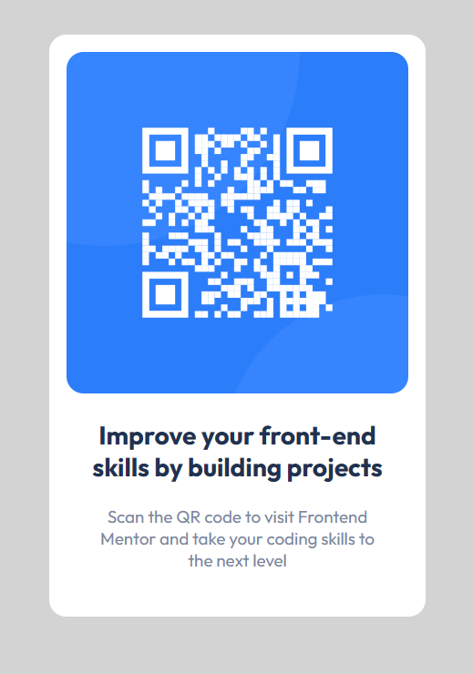

# Frontend Mentor - QR code component solution

This is a solution to the [QR code component challenge on Frontend Mentor](https://www.frontendmentor.io/challenges/qr-code-component-iux_sIO_H). Frontend Mentor challenges help you improve your coding skills by building realistic projects. 

## Table of contents

- [Overview](#overview)
  - [Screenshot](#screenshot)
  - [Built with](#built-with)
  - [What I learned](#what-i-learned)
  - [Continued development](#continued-development)


**Note: Delete this note and update the table of contents based on what sections you keep.**

## Overview

My 1st project I complete from Frontend Mentor. 

### Screenshot




### Built with

- Semantic HTML5 markup
- CSS custom properties
- Flexbox
- CSS Grid

### What I learned

I learned how to use frontend mentor to completed my 1st challenges.

```html
<h1>Some HTML code I'm proud of</h1>
```
```css
body {
    min-height: 100vh;
    display: flex;
    align-items: center;
} 
to center the QR code card on the page.   
```

### Continued development

I want to do more frontend mentor challanges! in React and TypeScript soon. 

